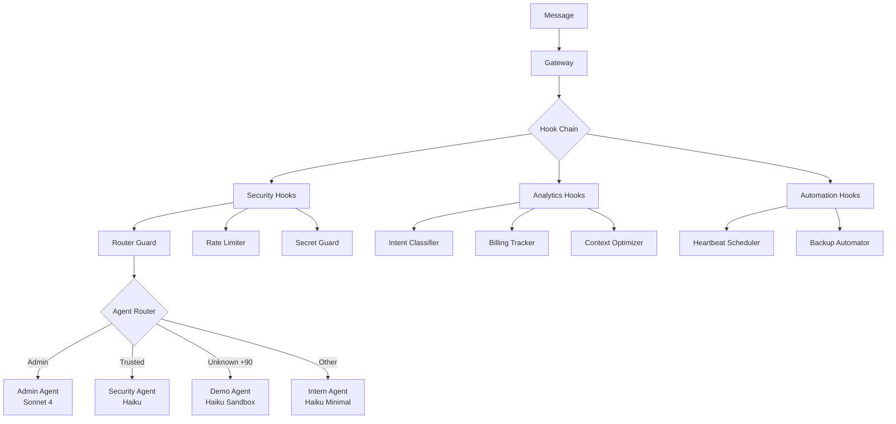

# System Architecture

## Overview

OpenClaw Extensions (Kamino) implements a **multi-layered hook system** with **contact-based routing** and **multi-agent coordination** on top of OpenClaw Gateway. It includes a **Mission Control web UI** for monitoring and control, served through **Cloudflare Workers** and **nginx** reverse proxy.

```
┌─────────────────────────────────────────────────────────────┐
│                 Management Layer (Mission Control)           │
│                                                              │
│  Browser → Cloudflare Worker (kamino-proxy)                 │
│          → nginx (IP allowlist + X-Kamino-Secret)           │
│          → /mc/  → npx serve :7891 (React SPA)             │
│          → /api/ → Hono API :9347 (REST + auth)            │
│          → /openclaw/ → Gateway :18789                      │
└──────────────────────────┬──────────────────────────────────┘
                           │ reads/writes OpenClaw data
┌──────────────────────────┴──────────────────────────────────┐
│                     WhatsApp / Telegram                      │
└──────────────────────────┬──────────────────────────────────┘
                           ▼
┌─────────────────────────────────────────────────────────────┐
│                    OpenClaw Gateway                          │
│  - WebSocket (port 18789)                                   │
│  - Config hot-reload (openclaw.json)                        │
│  - Hook discovery (~/.openclaw/hooks/)                      │
└──────────────────────────┬──────────────────────────────────┘
                           ▼
                    ┌──────────────┐
                    │  Hook Chain  │
                    └──────┬───────┘
                           │
        ┌──────────────────┼──────────────────┐
        ▼                  ▼                  ▼
┌──────────────┐  ┌──────────────┐  ┌──────────────┐
│  Security    │  │  Analytics   │  │  Automation  │
│  Layer       │  │  Layer       │  │  Layer       │
└──────┬───────┘  └──────┬───────┘  └──────┬───────┘
       │                 │                 │
       ▼                 ▼                 ▼
┌─────────────────────────────────────────────────────────────┐
│                    Agent Router                              │
│  - Contact-based routing (contacts.yaml)                    │
│  - Admin → admin agent                                       │
│  - Trusted → main agent                                      │
│  - Unknown +90 → guest workspace (sandbox)                   │
│  - Blocked → rejected                                        │
└──────────────────────────┬──────────────────────────────────┘
                           │
        ┌──────────────────┼──────────────────┐
        ▼                  ▼                  ▼
┌──────────────┐  ┌──────────────┐  ┌──────────────┐
│  Main Agent  │  │ Coder Agent  │  │  Guest Agent │
│ (Sonnet 4.6) │  │ (Sonnet 4.6) │  │  (Haiku)     │
│ Full access  │  │ Code-focused │  │  Sandbox     │
└──────────────┘  └──────────────┘  └──────────────┘
```

---

## Data Flow

### 1. Message Reception

```
WhatsApp → Gateway → contact-enricher hook
                   → Extract pushName, create contact record
```

### 2. Security Layer

```
router-guard → Check contacts.yaml
            → Block if in blocked list
            → Route to agent based on category

secret-guard → Redact API keys from responses

rate-limiter → Check daily token usage
            → Block if limit exceeded
```

### 3. Analytics Layer

```
billing-tracker → Log token usage to billing.jsonl

intent-classifier → Detect message intent
                 → Set historyLimit based on intent

context-optimizer → Build context based on intent
                  → Enable Anthropic caching
```

### 4. Agent Execution

```
Agent receives:
- SOUL (personality file)
- Bootstrap files (context)
- Tool whitelist
- Workspace path

Agent executes → handoff-manager watches
              → Escalate if needed (Haiku → Sonnet → Opus)

loop-detector → Start timeout timer
            → Kill if exceeds threshold
```

### 5. Post-Processing

```
Response generated → secret-guard redacts keys
                  → billing-tracker logs tokens
                  → mention-notifier checks @mentions
```

---

## Component Diagram



---

## Storage Architecture

```
~/.openclaw/
├── openclaw.json              # Main config
├── hooks/                     # Custom hooks (20)
├── souls/                     # Agent personalities (4)
├── logs/
│   ├── security.jsonl         # Security events
│   ├── billing.jsonl          # Token usage
│   └── gateway.log            # Gateway logs
├── data/
│   └── notifications.jsonl    # @mention queue
├── storage/
│   └── contacts/              # Contact records
│       └── +905xxx.json
└── workspaces/
    ├── admin/
    ├── security/
    ├── demo/
    └── intern/
```

---

## Event Flow

### agent:bootstrap Event

```
1. router-guard → Route to agent
2. intent-classifier → Detect intent
3. context-optimizer → Build context
   - greeting: last 3 messages
   - coding: last 50 messages + workspace files
4. loop-detector → Start timer
5. Agent execution begins
```

### agent:response Event

```
1. handoff-manager → Check for escalation request
2. secret-guard → Redact API keys
3. billing-tracker → Log token usage
4. mention-notifier → Extract @mentions
5. Response sent to user
```

### command Event

```
1. emergency-bypass → Check for /o command
2. vps-mode-switch → Check for /vps command
3. Standard command processing
```

### gateway:startup Event

```
1. heartbeat-scheduler → Load heartbeat.yaml
2. security-reporter → Initialize
3. backup-automator → Check git status
```

---

## Multi-Agent Coordination

### Agent Communication

```
Admin Agent: "Daily özet raporu için @security"
           ↓
mention-notifier → Create notification
           ↓
notifications.jsonl
           ↓
heartbeat-scheduler (5min interval)
           ↓
Security Agent receives notification
```

### Task Locking

```
Agent 1: Start task "deploy"
      ↓
task-lock-manager → Set lock in .locks/deploy.json
      ↓
Agent 2: Try same task
      ↓
task-lock-manager → Lock exists, reject
```

---

## VPS Mode Switching

```
Admin: "/vps kamino"
    ↓
vps-mode-switch hook
    ↓
Execute: ~/openclaw-switch.sh kamino
    ↓
Docker stop → Update symlink → Docker start
    ↓
~/.openclaw-active → ~/.openclaw-kamino/
    ↓
Gateway restarts with new config
```

**Persistence:**
```
VPS Reboot
    ↓
systemd: openclaw-mode.service
    ↓
Read ~/.openclaw-mode (contains "kamino")
    ↓
Restore correct symlink
    ↓
Docker starts with saved mode
```

---

## Security Model

### Sandbox Restrictions

```
Demo Agent & Intern Agent:
- No write_to_file
- No run_command
- No delete_file
- Blocked paths: ~/.ssh, ~/.openclaw/creds, /etc
```

### Rate Limiting

```
Per-user daily limits (contacts.yaml):
- Admin: unlimited
- Trusted: 200,000 tokens
- Unknown: 50,000 tokens

Enforcement: rate-limiter hook
Logging: billing.jsonl
```

---

## Performance Optimizations

1. **Intent-based history**: Reduce context window for simple messages
2. **Anthropic caching**: Cache SOUL + workspace files
3. **Model fallback**: OpenRouter free tier → Haiku → Sonnet
4. **Tool filtering**: Per-agent tool whitelists

---

## Monitoring & Observability

```
security.jsonl:
- Unauthorized access attempts
- Rate limit violations
- Emergency bypass usage

billing.jsonl:
- Token usage per user
- Model costs
- Daily aggregates

gateway.log:
- Hook execution times
- Error stack traces
```
